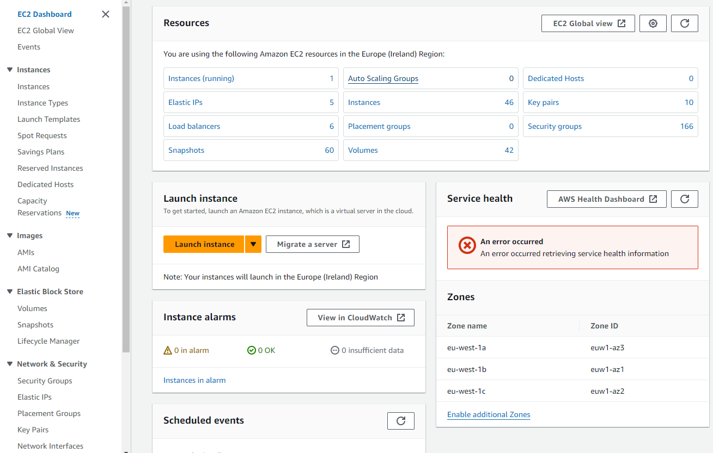
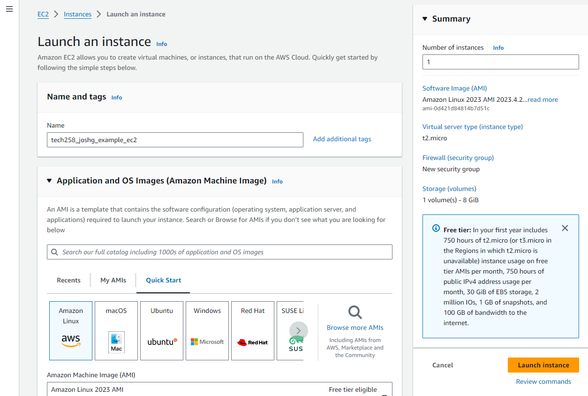
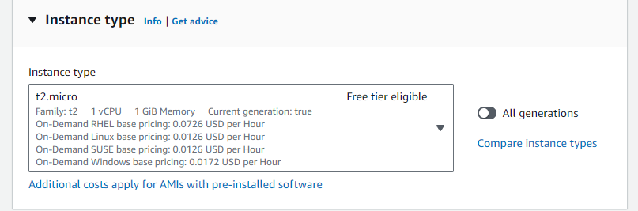
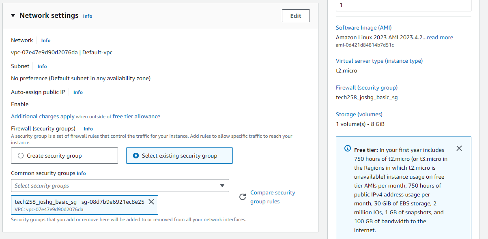

# Cloud Learning
This document explores concepts crucial to both virtual instances and cloud computing through the setup of a web server on a fresh EC2 instance on AWS. 

As well as describing the steps required to set up the aformentioned server, I'll use the steps required as a jumping-off point to explore key ideas when appropiate. Topics I'll cover include:
1) Virtual Machines
2) EC2 Instances
    - Managing Instances 
    - Using Bash to interact with EC2 instances
3) SSH key pairs on AWS
4) Networking and ports  
5) Basic Linux commands
6) Nginx

Topics will be clearly titled as they are introduced

## AWS EC2 Deployment Guide
Before creating our EC2 instance on AWS, it's worth outlining why we would want to create a virtual machine in the cloud. Let's start by looking at virtual machines:

### What are virtual machines
**Virtual machines (VMs)** are software-based emulations of physical computers. They allow you to run multiple instances of an operating system, and all of the other required software we need, on a single machine. 

**Virtualisation** is the act of creating virtual computing instances, with their own compute cores, memory, storage and OS.  

Thanks to an abundance of memory, compute and storage, the servers managed by cloud providers give us a great environment to spin up and scale virtual machines. 

### Amazon Elastic Compute Cloud (EC2)
Amazon Elastic Compute Cloud (EC2) is a web service provided by Amazon Web Services (AWS) that offers resizable compute capacity in the cloud. EC2 allows users to easily launch virtual machines, known as **instances**, and scale resources according to requirements. 

We can configure our EC2 instances with various operating systems, CPU, memory, storage, and networking options, providing great flexibility and customization.

## Setting up our EC2 instance

**NOTE:** Before spinning up any new EC2 instances, or indeed using any AWS services, it's vital we understand our organisations AWS and cloud policies. For example, there might be a specific region, EC2 instance type, or security policy, we need to implement. **If you have any questions or doubts speak with your DevOps team before following this guide**

All information is correct as of 2024-04-18.

1) **Start by opening your EC2 dashboard**

    This can be found by typing in EC2 in the seach bar at the top of the screen. It should look something like this:
    

2) **Click 'Launch Instances'**

    In this example we're creating an EC2 instance from scratch, so ignore the drop-down

3) **Name your EC2 Instance**

    Good naming convention is vital in allowing us to effectively manage EC2 instances. Organisations will generally specify naming conventions. 

    It's helpful to also specify the purpose or use-case of an EC2 instance in it's name. For example:
     

4) **Choose an Application and OS Image (Amazon Machine Image)**

    AWS Gives us a wide range or machine images temples to choose from when creating our EC2 instance. Each machine instance comes with it's own Amazon Machine Image ID (AMI ID). 

    For the purpose of this guide choose 'Ubuntu'.

### Machine Images
A machine image is a snapshot or template of a computing environment. It includes the operating system, software, configurations, and data. It encapsulates everything needed to replicate a specific computing environment, ensuring consistency across different machines or instances. 

5) **Set Instance Type**

    This allows us to specify the hardware provisioned for our EC2 instance. Instances are grouped into families (e.g t2), which vary in vCpus and memory.  

    In general, we want to use the smallest (read cheapest) instance available. 

    Choose t2.micro, or the instance type required by your organisation.

6) **Enable Key Pair Login**

    We can specify a SSH key pair to be used to access our EC2 instance, allowing us to keep it secure. As well as uploading our own public key, AWS allows us to generate one, or use a pre-existing one from the drop-down menu, a useful feature for administration. 

7) **Specify Network and Security Settings**

    A nice feature of AWS is that is abstracts a lot of the networking away, unlike Azure. 

	1 important part we do need to setup though is the Firewall (Security Group). We 	will set up a new security group, and allow SSH and HTTP traffic. 

	Once again, naming of this Security group is important. We can change this with the edit button.

8) **Allocate Storage**

    Before we can launch our machine we need to specify how much storage we need. Exactly as we did when setting the instance type, we want to cut our cloth to measure. Provisioning more storage than our machine needs is a waste of money.

    As the instance we are creating is incredibly lightweight, 8gb of storage should be more than sufficient.

9) **Review and Launch Instance**

    Double-check all of setting are correct before launching the instance.

## Managing EC2 Instances

The EC2 instance we just created is now live. It will likely need a minute or two to finish setting up, but we can already see it, as well as other EC2 instances in organisation, on the main dashboard.

We can interact with our EC2 instance by clicking on it's unique ID.

## Connecting to our EC2 Instance

