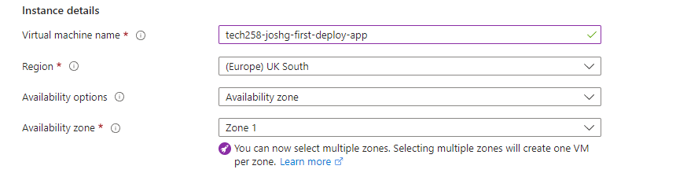
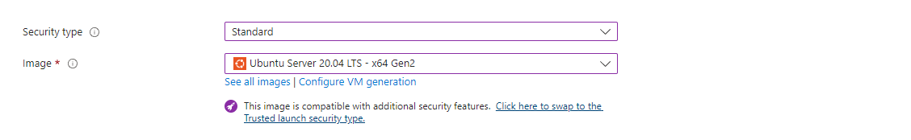
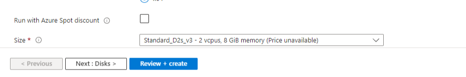
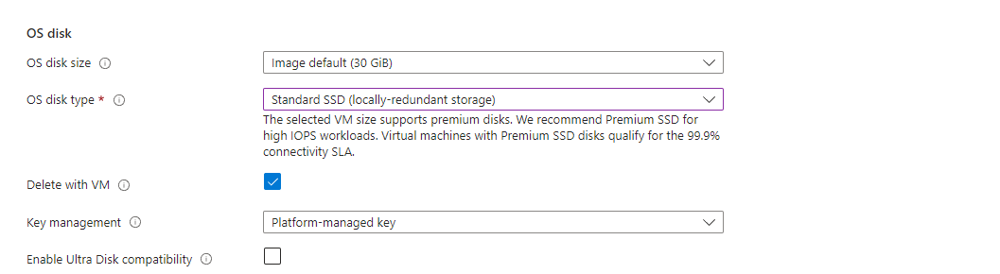
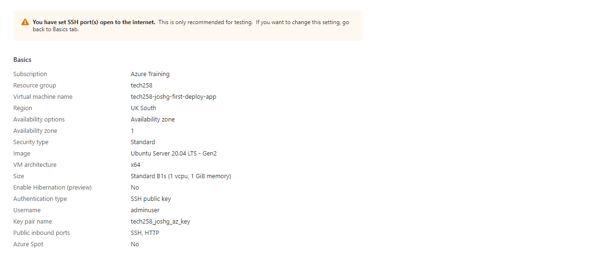

# 2 tier app deployment on Azure

This readme describes how to deploy a 2-tier web server and database application on Azure using virtual machine instances and a virtual network. 

The virtual machine instance hosting the web server uses nginx and Node.js. The virtual machine instance hosting the database uses Mongodb.

Much of the instance setup has been automated with bash scripts. Copies of these scripts can be found in the parent folder.

## Instructions
NOTE: if you don't already have a suitable SSH public key on your virtual network please set one up before continuing.

## Launching a virtual network 
Azure gives us the option of creating a virtual network to let our virtual machines securely communicate with each other. We're going to start by creating a virtual network.

1) Open the resource group the SSH key and virtual network are stored and create a new virtual machine.
2) Choose an appropiate name for the virtual network and make sure it's being deployed in the same region we're going to deploy our virtual machines in.
3) Address space: if it isn't already populated the fields with it then add 10.0.0.0/16
4) Just below this create our two subnets:
   1)  public-subnet, Address range: 10.0.2.0/24
   2)  private-subnet, Address range: 10.0.3.0/24
5) Review and create

## A note on the virtual machine instance setup
This README will only specify the settings we require when launching our virtual machine instances.

For a more comprehensive look at virtual machines on Azure and the set up process, as well as why we're using these settings, a more detailed markdown file exploring process of creating a new virtual machine instance using the Azure GUI can be found [TBC]

## Setting up the database
Note: unlike later steps in this guide, the order which we launch the virtual machines is not important. If you need to terminate an instance and launch a new one these steps will still be applicable.

### Launching the virtual machine
1) Open the resource group the SSH key and virtual network are stored and create a new virtual machine.
2) Choose an  appropiate name for the new instance - something descriptive and easy to find in the instance management dashboard. For example:
```
tech258-joshg-first-deploy-db 
```
1) Suitable name
2) Choose the same region as the one we selected for the virtual network. In this example its UK South
   
3) Set security to standard and choose the desired VM image - this example uses Ubuntu 22.04 Pro - Gen 2
   
4) Set size to B1S before pressing scrolling down for more options
   
5) Username. Change this to `adminuser`
   
6) SSH key. Use the key discussed at the top of this README
7) Disk. Change type to standard SSD
   
8) Networking. Choose the virtual network we created a moment ago and make sure the following ports are open to incoming connections:
     - port 22 open for ssh. This will allow us to config the server
     - port 80 open for http.
9)  Review settings and then launch the instance
    
## Setting up the web server
Note: unlike later steps in this guide, the order which we launch the virtual machines is not important. If you need to terminate an instance and launch a new one these steps will still be applicable.

### Launching the virtual machine
1) Open the resource group the SSH key and virtual network are stored and create a new virtual machine.
2) Choose an  appropiate name for the new instance - something descriptive and easy to find in the instance management dashboard. For example:
```
tech258-joshg-first-deploy-app 
```
1) Suitable name
2) Choose the same region as the one we selected for the virtual network. In this example its UK South
   
3) Set security to standard and choose the desired VM image - this example uses Ubuntu 22.04 Pro - Gen 2
   
4) Set size to B1S before pressing scrolling down for more options
   
5) Username. Change this to `adminuser`
   
6) SSH key. Use the key discussed at the top of this README
7) Disk. Change type to standard SSD
   
8) Networking. Choose the virtual network we created a moment ago and make sure the following ports are open to incoming connections:
     - port 22 open for ssh. This will allow us to config the server
     - port 80 open for http.
9)  Review settings and then launch the instance
    
    
    
### Configuring and starting the Mongodb database
The Mongodb database needs to be running and ready to receive incoming network connections before we can configure the server. This is because the script to seed the database is included in the server app.

We'll be running the database seeding script in the server setup shell file, so we need to need to configure the database first.

**Instructions**

If starting the virtual machines instance for the first time you need to grant permission to execute the script:
```shell
  chmod +x mongodb_setup.sh
```

Run the `mongodb_setup.sh` script:
```shell
  ./mongodb_setup.sh
```
This script does the following:
1) looks for updates, installs where appropiate
2) Installs Mongodb version 7.0.6.
3) Holds the Mongodb version so it won't be changed during future upgrades without user intervention. This is to ensure ongoing compatibility
4) Bind ip address in the monogod config file to allow incoming connections
5) Start mongodb
6) Enable mongod so to automatically starts when our instance starts up 

## Starting the web server
### Configuration
Now that our virtual machine hosting the database is live we have the information we need to point the server to it. 

In order to do this we provide the server with an environment variable that includes the ip address for the database server
```shell
export DB_HOST=mongodb://{database_private_ip}:27017/posts
```
where `{database_private_ip}` is the private ip address that the database can be found at.

Note that we are able to use the private ip address for this as both Virtual Machines are on the same Azure resource group. 

## Starting the server

If starting the virtual machine for the first time you need to grant permission to execute the script:
```
chmod +x server_setup.sh
```
Run the `server_setup.sh` script:
```shell
  ./server_setup.sh
```
This script does the following:
  1) looks for updates, installs where appropiate
  2) Installs nginx
  3) Set reverse proxy in nginx config
  4) Enables nginx
  5) Installs node
  6) Clones the app code from github
  7) Changes directory into the app folder
  8) install dependecies with npm
  9) install pm2 -> allows us to run the node app in the background.Freeing up the bash window. 
  10) stops any previously running instances of the app 
  11) runs the app with pm2

### Setting the reverse proxy
We can amend our nginx config file to get nginx to act as a reverse proxy. 

This allows us can forward all requests on the ip adress to port 3000 - allowing us to direct traffic to our Node.js server without the user having to specify the port it's running on. 

We can manually specify this in the file `/etc/nginx/sites-enabled/default`, by including the following line:
```shell
sudo sed -i '51s/.*/\t        proxy_pass http:\/\/localhost:3000;/' /etc/nginx/sites-enabled/default
```

We can also automate this process by including a `sed` command in our `server_setup.sh` file by using the following:
```shell
sudo sed -i '51s/.*/\t        proxy_pass http:\/\/localhost:3000;/' /etc/nginx/sites-enabled/default
```


## Using the web server
We can access the web server using `http`. 
```html
http://{SERVER IP ADDRESS}
```
Type in the ip address in to a browser window to see the provisioning test page.

Adding `/posts` to our ip address allows us to GET information from the database we seeded during the server setup.
```html
http://{SERVER IP ADDRESS}/posts
```