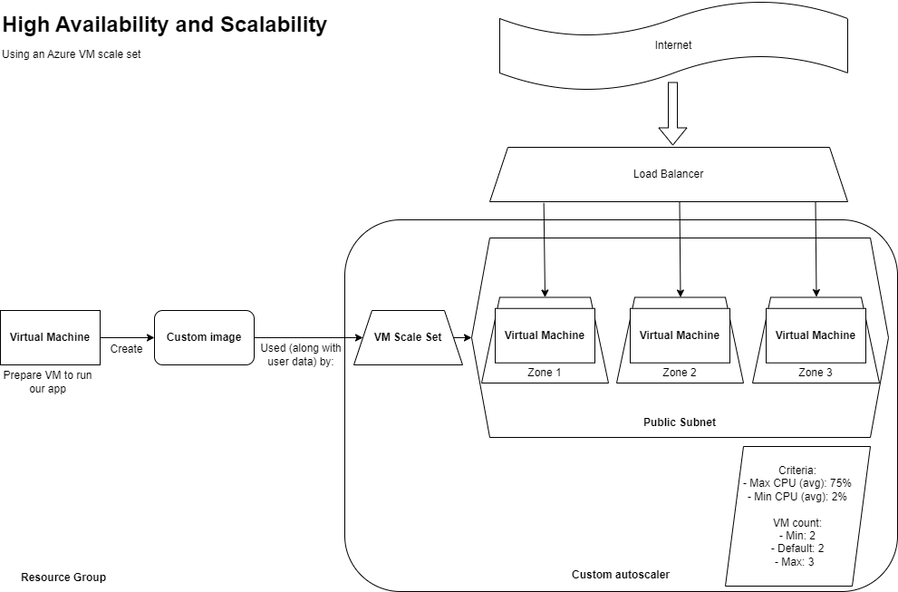
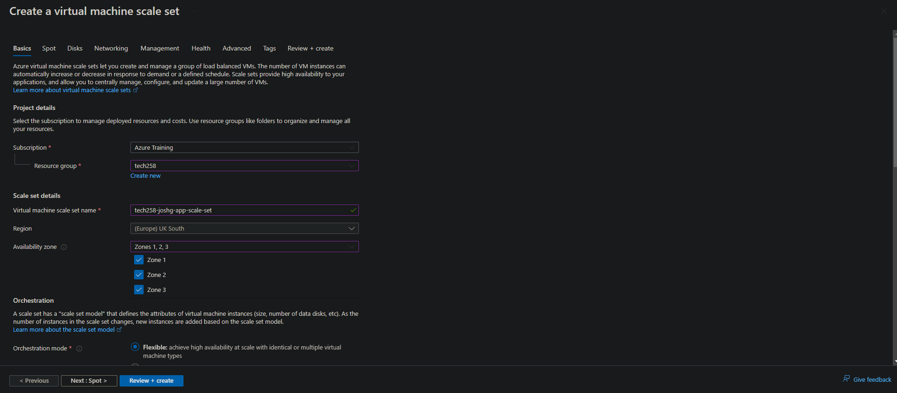
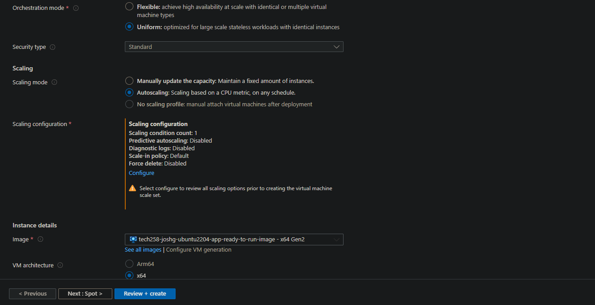
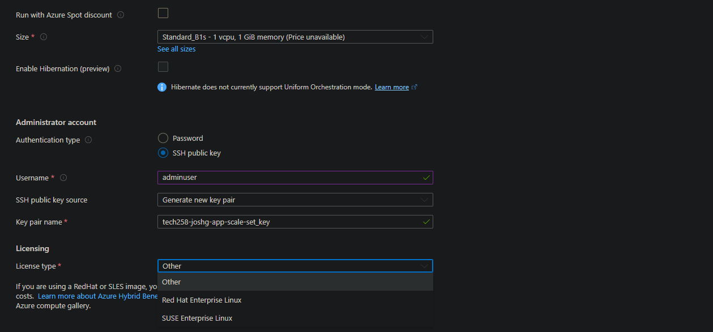

# High Availability and Scalability
**High availabilty** is vital for popular, public-facing cloud services, and is a key metric for DevOps engineers. We need to ensure that services are consistently accessible and operational, minimizing downtime and service disruptions. 

Cloud providers achieve us to realise high availability through redundancy (multiple virtual machines), fault tolerance mechanisms (automatic health monitoring and recovery), and distributed architecture (virtual machines in different availability zones), which ensure that even if individual components fail, the system as a whole remains operational.

**Scalability** allows our application to meet variying demand. We can scale up capacity when our application is seeing a lot of traffic, and scale down the number of virtual machines when we are seeing less demand.

In the cloud, **scalability** is achieved through features like auto-scaling, which dynamically adjusts resources such as computing power and storage based on demand. 



Our **auto scaler** will use the image we created and tested previously, as well as a little bit of user data, to launch new virtual machines. This auto scaler will follow a set of criteria we give it.

In order to orchestrate traffic to different virtual machines we'll require a **load balancer** - this will direct traffic to any virtual machines currently running.

In Azure we achieve this with a scale set

## What we need working before we can create our scale set
Before we can create our scale set, we need to have a thoroughly tested virtual machine image, and accompanying user data script.

We also need to know what parameters our virtual machines typically operates within, as well as when we may need to scale. This README on monitoring and alerts describes hows we can get data on CPU, network and storage usage from our virtual machine.

## Creating our virtual machine scale set
### Basics
1) Select the resouce group and choose a suitable name for the scale set. For example:
```
tech258-joshg-app-scale-set
```
2) Availability zones - Select all of 1, 2 and 3 from the menu



3) Orchestration mode - choose uniform

4) Scaling mode - select autoscaling. A option to configure this will then appear. click the link



5) We're then taken to a **Scaling Configuration** menu. This is where we set scaling conditions such as min and max number of instances. **Click the pencil right to Default Condition** to edit.

6) Change the conditions to our desired parameters. For the example app I used:
   1) Minimum - 2
   2) Maximum - 3
   3) Scale out CPU threshold 75%
   4) Scale in CPU threshold 20% 

Once these are set click save and return to the **basics** menu.

7) Choose the image we tested previously for the scale set to use

8) Set size to Standard_B1s

9) Set authentication type to SSH public use. Change username and SSH public key source

10) Update license type to *Other*

  

### Disks


### Networking


### Health

### Advanced


Name: tech258-joshg-app-scale-set

Availability zone: choose all of 1, 2 and 3


Scaling mode: Autoscaling, then click the configure that appears
    change the default condition by clicking the pencil.


Networking:

Create a load balancer:
- Give it a suitable name (tech258-joshg-app-scale-set-lb)
- Type is public as our load balancer is public facing
- protocol is TCP
- Ports can both be 80 (Note that nginx is already forwarding requests to 3000 with the reverse proxy)
- Inbound NAT rule. Backend port is 22 (allows us to SSH in). 

Health:
- Enable application health monitoring
- Enable automatic repairs

Advanced:
- Enable user data


we can SSH into an individual scale set by going through the load balancer. We need to pass the port it's running on as an argument:
```
    ssh -i ~/.ssh/tech258_joshg_az_key   -p 50001 adminuser@4.158.76.74
```
remembering that we started allocating ports at 50000 (as we stopped the second instance it will be 50001)


### Cleaning up a load balancer

we need to remove:
- Load balancer
- public IP address of load balancer
- scale set
