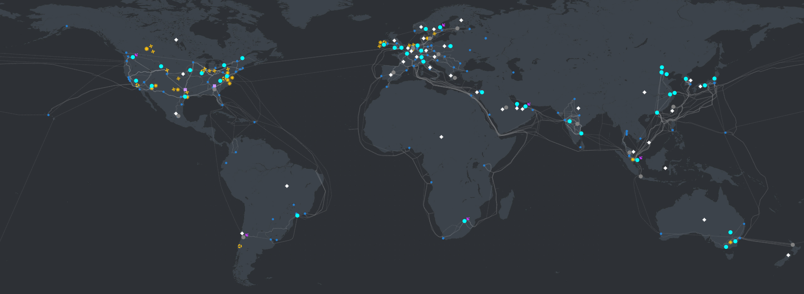
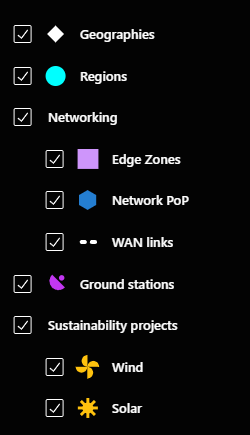

# Intro to Azure

Azure is a cloud computing platform and service provided by Microsoft. It offers a wide range of services, including computing power, storage solutions, networking capabilities, databases, machine learning, analytics, and more. 

Azure is the second largest cloud computing provider, behind AWS for both market share and number of availability zones. This is in part due to Azure being later to market by several years - though Microsoft have closed the gap with competitive pricing and the introductions of features such as Linux support.

Azure enables businesses to build, deploy, and manage applications and services through Microsoft's global network of data centers.

## Azure features

- **Comprehensive Service Offering**: Azure provides a vast array of services catering to various needs of businesses, from virtual machines and storage to AI and IoT services. This comprehensive offering allows organizations to meet their diverse requirements without having to rely on multiple cloud providers.
- **Hybrid Capabilities**: Azure offers integration and compatibility with on-premises infrastructure, facilitating hybrid cloud deployments. This allows businesses to leverage their existing investments in infrastructure, especially those running on Microsoft technology, while gradually transitioning to the cloud at their own pace.
- **Scalability and Flexibility**: Azure's infrastructure is designed to scale dynamically based on demand, allowing businesses to quickly scale up or down resources as needed. This scalability is essential for handling fluctuating workloads and ensuring optimal performance.
- **Global Presence**: Azure operates a vast network of data centers spread across regions worldwide. This global presence enables businesses to deploy their applications and services closer to their users, reducing latency and improving performance.
- **Security and Compliance**: Azure prioritizes security and compliance, offering robust built-in security features, such as identity management, encryption, threat detection, and compliance certifications. This makes Azure a trusted platform for businesses handling sensitive data and operating in regulated industries.
- **Integration with Microsoft Ecosystem**: Azure seamlessly integrates with other Microsoft products and services, such as Office 365, Dynamics 365, and Windows Server. This integration simplifies management, enhances productivity, and enables businesses to leverage their existing Microsoft investments in their cloud strategy.

## Azure regions and aviability zones

## Connecting to Azure

DevOps engineers typically access Microsoft Azure through a combination of tools and interfaces provided by Azure itself, as well as third-party tools and integrations. Here are some common methods DevOps engineers use to access Azure:

1) Azure Portal: The Azure Portal is a web-based interface provided by Microsoft Azure, offering a graphical user interface (GUI) for managing Azure resources. DevOps engineers can use the portal to provision, configure, monitor, and manage Azure services and resources. It provides a visual representation of the Azure environment and allows users to interact with resources through a point-and-click interface.
2) Azure CLI (Command-Line Interface): Azure CLI is a cross-platform command-line tool provided by Microsoft for managing Azure resources from the command line. DevOps engineers can use Azure CLI to perform various tasks, such as resource provisioning, configuration, monitoring, and automation. It offers a scripting interface for automating repetitive tasks and integrating Azure management into scripts and workflows.
3) Third-party tools and integrations. This includes popular DevOps tools such as Jenkink, Terraform, Ansible and Chef. 