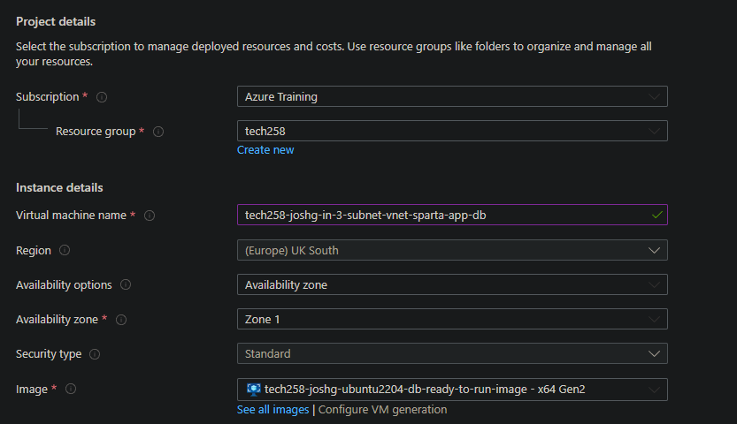

# Advanced networking with a Network Virtual Appliance and a DMZ
We can improve network security for our application applying stricter conditions then just relying on network security.

Up to now on Azure we have been reyling on our virtual network to handle traffic. We've not specified what types of traffic we allow into our database - current all ports on the virtual network are all. We can specify to only allow incoming MongoDB traffic (port 27017) and SSH (port 22).

## Implementing DMZ and Network Virtual Appliance

Furthermore, we can also set up a DMZ subnet to sit in the virtual network, between the app and DB. The includes a VM which acts as a **Network Virtual Applicance (NVA)**. 

DIAGRAM GOES HERE

This NVA has its own rules for its network security group, as well as a iptable on the NVA. This ensures the DMZ acts like a firewall and will ensure that only traffic from the right source will be allowed to talk to the database, making our architecture more secure.

Initially while setting up our NVA we will want SSH available form public IP addresses, but once It’s all setup we will want to remove this. We can also take this approach to our database.

In order to achieve this we need to set set up specific routes to achieve this. This is where a DMZ is different from NSGs – we are being more prescriptive about the path we need to take to the database. We specify these routes with a **route table**. If the traffic satisfies the route table we will forward it on to the database. If not, we will filter it out.  

## Sanitising traffic from the web server

Note that the NVA and DMZ subnet doesn’t sanitise traffic from the web server, it just ensures that the only way we can connect to the DB is via the NVA forwarding traffic from the web sever. 

The NVA and DMZ doesn't protect us from data injection or XSS - this needs to be handled and filtered out on the web server.


## Steps to create our application with an NVA and DMZ

### Creating a 3 subnet virtual network

1) Create a new virtual network. We need a new virtual network so there's a DMZ subnet for the NVA. We can also set the enable the DB's subnet as a private subnet, meaning there's no outbound access.
2) Give the virtual network an intuitive name. For example:
```
   tech258-joshg-3-subnet-vnet
```
3) Specify the subnets. We'll need the following:
   1) public
   2) dmz
   3) priviate (when setting up the private subnet select the private subnet - no outbound means we need to use our image with mongo preinstalled).

   
4) This is so we have the address space for the DMZ
   
### Creating our virtual machines



Set up DB VM
    Note that we don't need a public IP address


Set up App VM

Check it's all working before creating the NVA VM


Once the DMZ is setup we can ssh in and ping the other VMs

### Create the route table

Not that after the route tabe has been set up we can no longer ping from our app to db. 

There are 2 places we need to enable port forwarding:
1) On Azure - NVA network settings
   1) To public (check screenshots)?
2) SSH in the NVA
   1) We can use the following command to see if ip forwarding is enabled `sysctl net.ipv4.ip_forward` if it's set to 0 its off
   2) we need to sudo into the following config file to change this `sudo nano /etc/sysctl.conf`
   3) after changing the config we need to update the settings with `sudo sysctl -p` 
   4) Pinging will now work again


## iptable

We are now ready to set up iptables

NOTE: iptable setup can be a pain, and if done incorrectly we can lock ourselves out. It's vital we do this in the right order

We can create a script to do this for us. 

At present the NVA doesn't filter any network traffic. It just forwards all traffic to the DB VM. The moment we run this script it will start filtering requests by IP

You'll need to amend permissions before running the script


## Bind ip on DB

finally we need to change the bind ip on the db to restrict it to the app vm.

use one of the virtual machines as a jump box to ssh into the DB