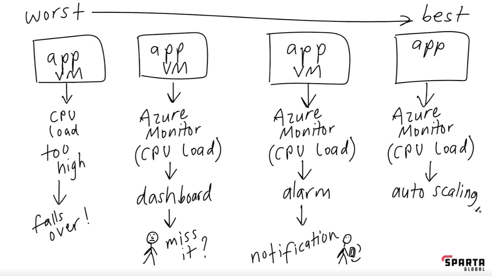
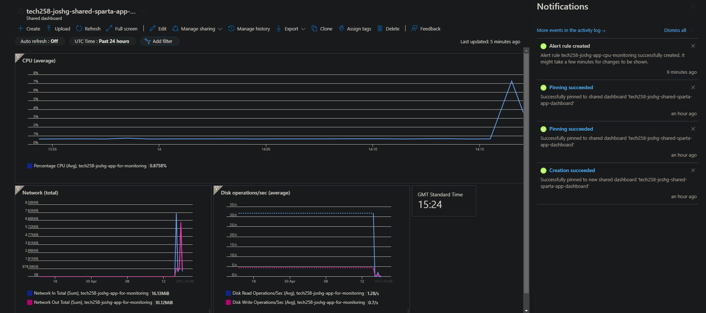

# Monitoring and Alerts

Both AWS and Azure provide us with a powerful set of tools to monitor the health of our Virtual Machines.

These monitoring tools can automate alerts, as well as actions to take when criteria are met. This can be anything from an email or text, to launching new virtual machines to better meet demand.

## Why monitor our instances.

Monitoring is a crucial responsibility of DevOps engineers. We need to be able to respond to changes such as increased demand, loss of availability zone ect.

As well as avoiding any loss in revenue due to a our app not being available, monitoring our VMs health, and intervening when required, allows us to maximise uptime of our services in the cloud. Uptime is usually a KPI, or part of a SLA, for DevOps engineers.

## Different levels of monitoring
We can think about different levels of monitoring, and organise them by capibility, depending on both how responsive they are and how much much intervention is required:

(Humans not to scale)

The levels are monitoring in the diagram are as follows:
1) Do nothing. Don’t monitor the instance and let it fall over when traffic exceeds capacity. Not ideal. 
2) Manually monitor a dashboard (either Azure monitor or AWS CloudWatch) and spin up a new vm when reaching capacity. Either very labour intensive, or liable to us missing alerts. 
3) Alerts and notifications to let us know when nearing capacity. DevOps engineer then manually sets up new instance. Better than 2 as we can receive notifications when away from our desk, transfer them when on AL ect.
4) Autoscaler. The cloud platform automatically responds to changes and manages the ecosystem on our behalf.

We can respond to changes by creating a new instance (perhaps if a certain availability zone goes offline), scaling up and scaling down. We scan spin up a virtual machine more suited to current demand and transfer workload to the new instance. 

It's important to consider that scaling isn't just for increased demand - we can move applications to cheaper services during times of lower demand to save money as well.

## Dashboards
We can create dashboards to 

### How to set up a dashboards on Azure

## Alerts

### How to set up alerts on Azure
